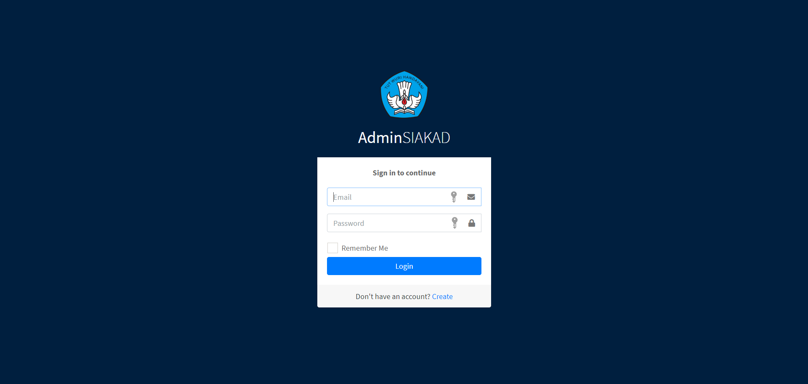
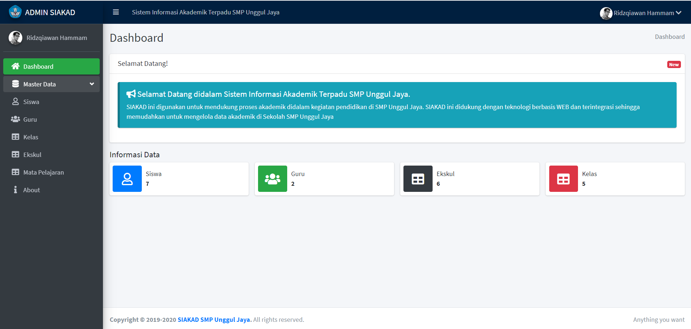
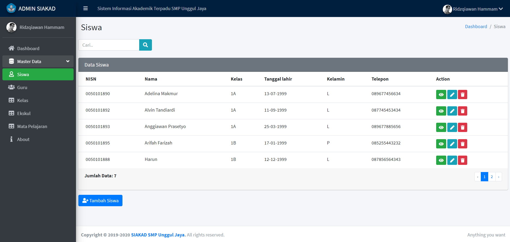
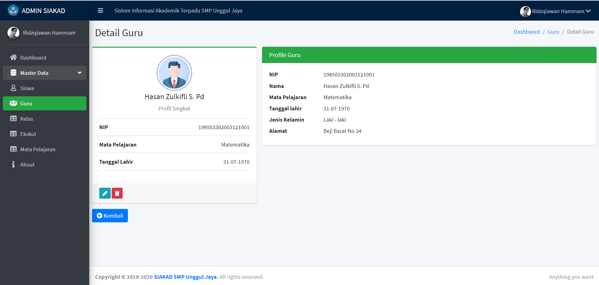

## About Laravel

Laravel is a web application framework with expressive, elegant syntax. We believe development must be an enjoyable and creative experience to be truly fulfilling. Laravel takes the pain out of development by easing common tasks used in many web projects, such as:

- [Simple, fast routing engine](https://laravel.com/docs/routing).
- [Powerful dependency injection container](https://laravel.com/docs/container).
- Multiple back-ends for [session](https://laravel.com/docs/session) and [cache](https://laravel.com/docs/cache) storage.
- Expressive, intuitive [database ORM](https://laravel.com/docs/eloquent).
- Database agnostic [schema migrations](https://laravel.com/docs/migrations).
- [Robust background job processing](https://laravel.com/docs/queues).
- [Real-time event broadcasting](https://laravel.com/docs/broadcasting).

Laravel is accessible, powerful, and provides tools required for large, robust applications.

## Learning Laravel

Laravel has the most extensive and thorough [documentation](https://laravel.com/docs) and video tutorial library of all modern web application frameworks, making it a breeze to get started with the framework.

If you don't feel like reading, [Laracasts](https://laracasts.com) can help. Laracasts contains over 1500 video tutorials on a range of topics including Laravel, modern PHP, unit testing, and JavaScript. Boost your skills by digging into our comprehensive video library.

## SIAKAD Sekolah
SIAKAD Sekolah adalah sebuah web admin panel yang befungsi untuk mengelola data yang ada didalam suatu sekolah (untuk saat ini hanya guru dan siswa, akan diupdate kembali). Memiliki fitur mengelola data siswa dan nilai setiap mata pelajaran dan pendataan guru. Admin panel ini hanya memiliki satu role yaitu admin.

### Tools Used

1. Laravel Framework
2. HTML
3. CSS
4. JQuery
5. Bootstrap 4
6. MySQL Database

### Feature

1. CRUD Siswa
2. CRUD Guru
3. Profile Siswa and Guru
4. Add Ekskul, Kelas, Mata Pelajaran
5. Login and Register

## Preview Website

Check the preview on this link: http://ridzqiawanhs.my.id

### Login

### Dashboard

### Siswa

### Guru

## License

The Laravel framework is open-sourced software licensed under the [MIT license](https://opensource.org/licenses/MIT).
